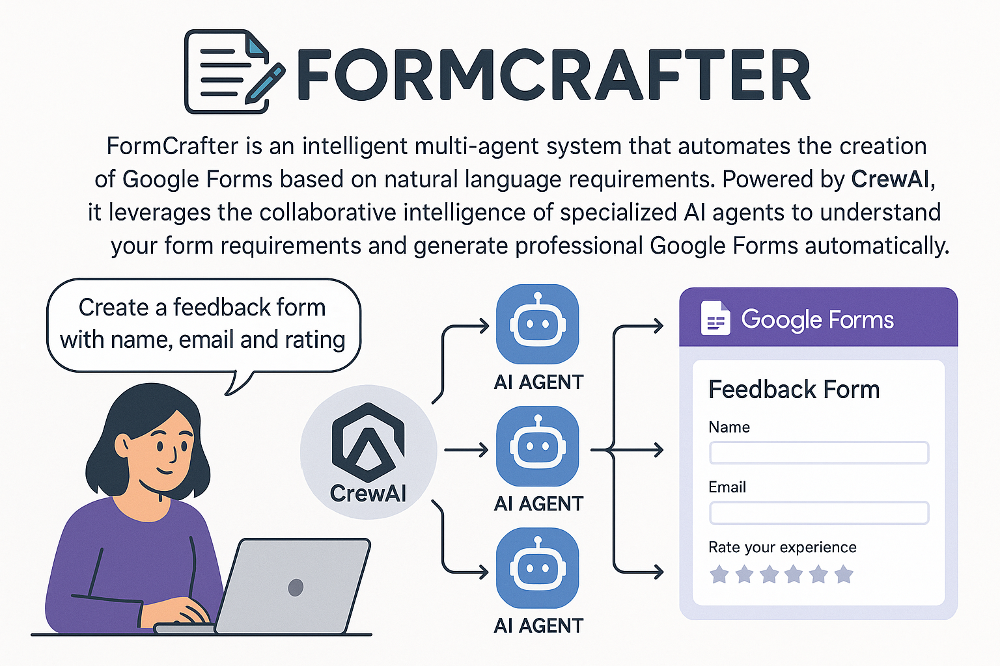

# FormCrafter 🚀


**An AI-Powered Google Forms Creation System using CrewAI**

FormCrafter is an intelligent multi-agent system that automates the creation of Google Forms based on natural language requirements. Powered by CrewAI, it leverages the collaborative intelligence of specialized AI agents to understand your form requirements and generate professional Google Forms automatically.

## ✨ Features

### 🤖 **Multi-Agent Intelligence**
- **Requirement Understanding Agent**: Analyzes and comprehends form requirements from natural language descriptions
- **Form Creation Agent**: Translates requirements into well-structured Google Forms with appropriate questions

### 🎯 **Smart Form Generation**
- **Natural Language Processing**: Input your form requirements in plain English
- **Intelligent Question Generation**: Automatically creates relevant questions based on context
- **Professional Form Structure**: Generates clean, user-friendly forms with proper formatting
- **Real-time Form Creation**: Direct integration with Google Forms API for instant form deployment

### 🔧 **Advanced Capabilities**
- **Contextual Understanding**: Analyzes complex requirements and asks clarifying questions when needed
- **Flexible Question Types**: Supports various question formats (text, multiple choice, scales, etc.)
- **User Preference Integration**: Incorporates user-specific preferences and context
- **Batch Processing**: Can handle multiple form creation requests efficiently

### 🌐 **Google Forms Integration**
- **Direct API Integration**: Seamlessly connects with Google Forms API
- **Instant Deployment**: Forms are created and ready for use immediately
- **Shareable Links**: Generates public URLs for easy form distribution
- **Professional Formatting**: Maintains Google Forms' native look and feel

## 🏗️ Architecture

FormCrafter follows a modular, agent-based architecture:

```
FormCrafter/
├── 🧠 Requirement Understanding Agent
│   ├── Analyzes input requirements
│   ├── Extracts key information
│   └── Identifies missing details
└── 🛠️ Form Creation Agent
    ├── Designs form structure
    ├── Creates Google Forms
    └── Generates shareable URLs
```

## 📋 Prerequisites

- **Python**: Version 3.10 to 3.13
- **Google Cloud Project**: With Forms API enabled
- **Service Account**: JSON credentials file
- **GEMINI_API_KEY**: For AI agent functionality

## 🚀 Quick Start

### 1. Installation

```bash
# Clone the repository
git clone https://github.com/achuajays/FormCrafter.git
cd FormCrafter 

# Install UV package manager (if not already installed)
pip install uv

# Install dependencies
crewai install
```

### 2. Configuration

Create a `.env` file in the root directory:

```env
MODEL=model
GEMINI_API_KEY=api_key
SERVICEJSON=/path/to/your/google-service-account.json
```

### 3. Google Cloud Setup

1. Create a Google Cloud Project
2. Enable the Google Forms API
3. Create a Service Account
4. Download the JSON credentials file
5. Set the `SERVICEJSON` environment variable to the file path

### 4. Run FormCrafter

```bash
# Execute the form creation process
crewai run
```

## 💡 Usage Examples

### Basic Form Creation

```python
# Example input for creating a feedback form
inputs = {
    'topic': """
        Create a customer feedback form with the following fields:
        - Customer name
        - Service rating (1-10 scale)
        - Comments and suggestions
        - Contact preference (email/phone)
    """
}
```

### Event Registration Form

```python
inputs = {
    'topic': """
        Design an event registration form for a tech conference:
        - Attendee full name and email
        - Company and job title
        - Session preferences
        - Dietary restrictions
        - T-shirt size
    """
}
```

### Survey Form

```python
inputs = {
    'topic': """
        Create a market research survey about mobile app usage:
        - Demographics (age, location, occupation)
        - Current apps used
        - Feature preferences
        - Usage frequency
        - Satisfaction ratings
    """
}
```

## 🛠️ Customization

### Modifying Agents

Edit `src/googleform/config/agents.yaml` to customize agent behaviors:

```yaml
requirement_understander:
  role: Custom Requirements Analyst
  goal: Your specific goal here
  backstory: Custom backstory for context
```

### Customizing Tasks

Update `src/googleform/config/tasks.yaml` for specific task requirements:

```yaml
form_creation_task:
  description: Custom task description
  expected_output: Specific output format
```

### Adding Custom Tools

Create additional tools in `src/googleform/tools/` for extended functionality:

```python
class CustomFormTool(BaseTool):
    name: str = "Custom Tool Name"
    description: str = "Tool description"
    # Implementation here
```

## 🎯 Use Cases

### **Business Applications**
- Customer feedback collection
- Employee surveys and evaluations
- Event registration management
- Lead generation forms
- Product research questionnaires

### **Educational Sector**
- Course evaluation forms
- Student registration
- Assignment submissions
- Research data collection
- Workshop feedback

### **Healthcare & Research**
- Patient intake forms
- Research survey creation
- Appointment scheduling
- Health assessment questionnaires
- Clinical trial data collection

### **Marketing & Sales**
- Contact forms for websites
- Market research surveys
- Product feedback collection
- Newsletter subscriptions
- Contest entry forms

## 🔧 Advanced Configuration

### Environment Variables

| Variable | Description | Required |
|----------|-------------|----------|
| `GEMINI_API_KEY` | OpenAI API key for AI agents | Yes |
| `SERVICEJSON` | Path to Google Service Account JSON | Yes |

### Agent Configuration Options

- **Temperature**: Control creativity level of responses
- **Max Iterations**: Limit agent processing cycles
- **Memory**: Enable conversation context retention
- **Knowledge Base**: Add domain-specific information

## 📊 Output Formats

FormCrafter generates:

1. **Live Google Form**: Immediately accessible via URL
2. **Form Configuration**: Detailed breakdown of form structure
3. **Execution Report**: Summary of the creation process
4. **Shareable Links**: Ready-to-distribute form URLs

## 🤝 Contributing

We welcome contributions! Please see our contributing guidelines:

1. Fork the repository
2. Create a feature branch
3. Make your changes
4. Add tests if applicable
5. Submit a pull request

## 📚 Documentation & Support

- **CrewAI Documentation**: [docs.crewai.com](https://docs.crewai.com)
- **Google Forms API**: [developers.google.com/forms](https://developers.google.com/forms)
- **GitHub Issues**: Report bugs and request features
- **Community Discord**: Join our development community

## 📄 License

This project is licensed under the MIT License - see the [LICENSE](LICENSE) file for details.

## 🙏 Acknowledgments

- **CrewAI Team**: For the powerful multi-agent framework
- **Google**: For the comprehensive Forms API
- **OpenAI**: For the underlying language models
- **Community Contributors**: For ongoing improvements and feedback

---

**Ready to craft intelligent forms?** 🎯

Get started with FormCrafter today and transform how you create and deploy Google Forms with the power of AI!
